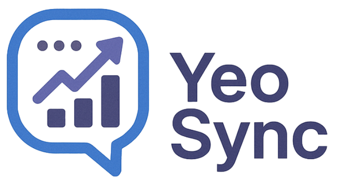
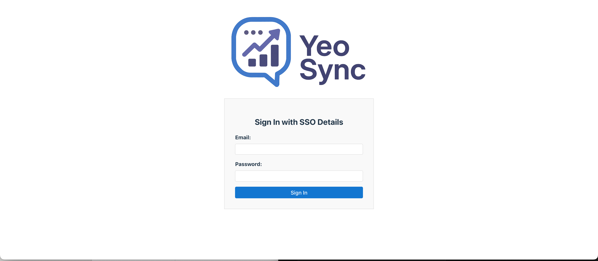
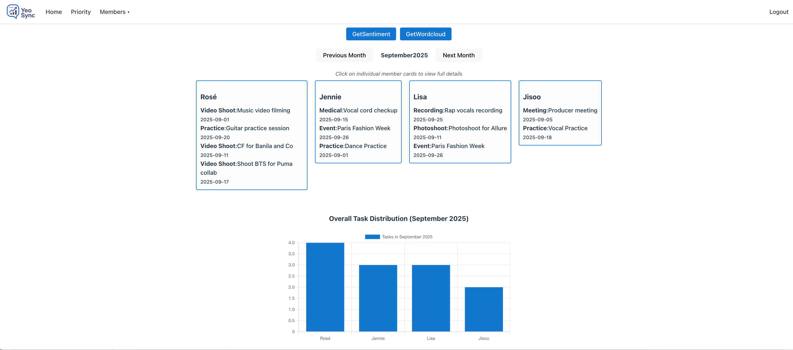
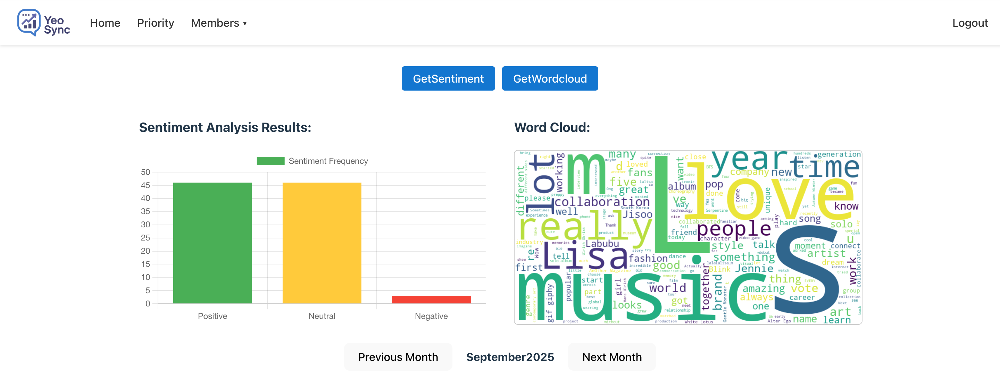
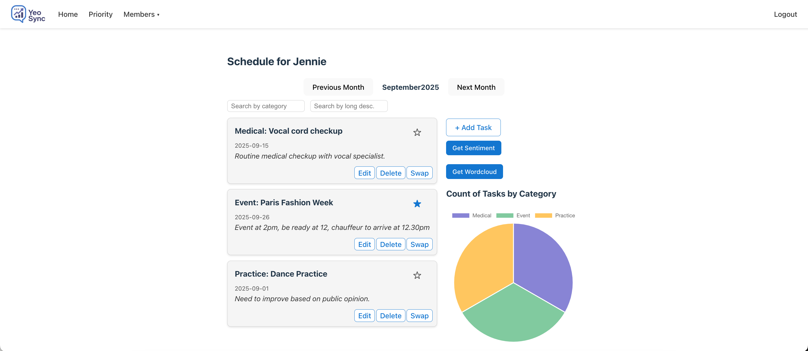
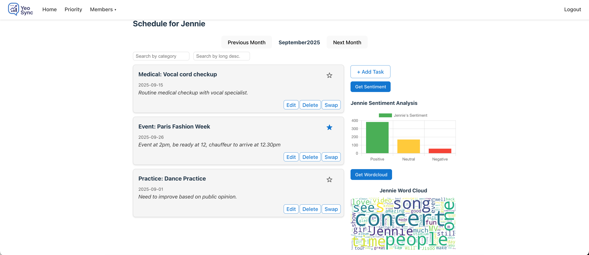
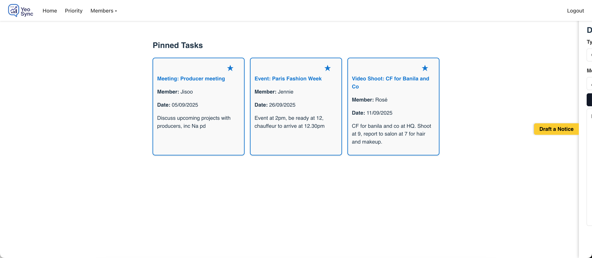
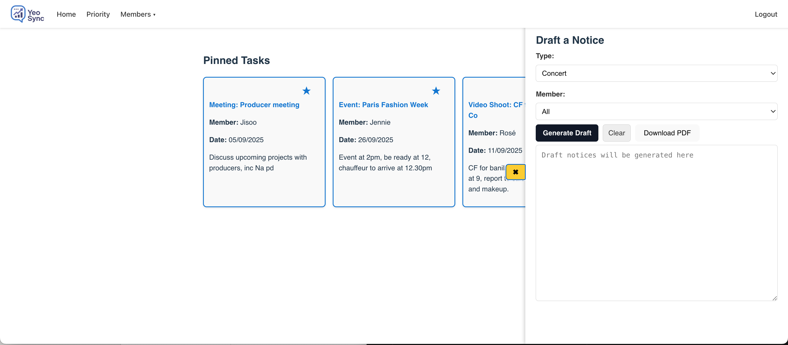
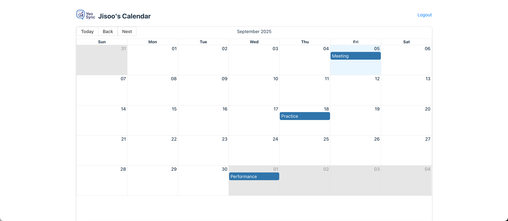

# YeoSync

## Background and Inspiration

As the Software Engineering bootcamp culminates with this capstone project, I wanted to build an application that combines the knowledge gained throughout the course along with my personal interests. 

Keeping in line with my usual fandom themed projects, I wanted to also incorporate my knowledge of Data Science and a particular field of interest of mine - Natural Language Processing. 

Enter YeoSync

YeoSync = 여론 (Yeo Ron/ Public Opinion) + Sync

An app that serves as a one-stop-shop for idol group managers where managers are able to respond swiftly to public opinion and allocate tasks strategically to boost/maximize the idols' image. Or if you will, SYNC activities to the public opinion.

- Sentiment analysis for both the group as a whole as well as for each member allows the managers to feel the public pulse on the group and its members.
- Word Cloud collates the buzzwords that are used in public discussions for group and members, allowing members to see trending terms used to talk about the group and its members. 
- Charts allow managers to look at the distribution of work among the members of the group, by count and by categories. Managers can use this data as well as the insights gained from the sentiment analysis and word cloud to assign as well as redistribute tasks among members accordingly. 
- Option to "pin" tasks that are of high importance, and the ability to draft notices for them. 

## Screenshots

### Login

### Home Screen

### Member Page

### Priority Page

### Artiste View

## Technologies Used
- [Express](https://expressjs.com/)
- [Node.js](https://nodejs.org/en)
- [MongoDB Atlas Database](https://www.mongodb.com/products/platform/atlas-database)
- [Vite](https://vite.dev/)
- [React](https://react.dev/)
- [Typescript](https://www.typescriptlang.org/)
- [Python](https://www.python.org/)
- [JSPdf](https://www.npmjs.com/package/jspdf)

## UI Libraries Used
- [React Charts](https://react-chartjs-2.js.org/)
- [React Big Calendar](https://www.npmjs.com/package/@types/react-big-calendar)

## Python Libraries Used
- [Textblob](https://textblob.readthedocs.io/en/dev/)
- [Wordcloud](https://pypi.org/project/wordcloud/)
- [Pandas](https://pandas.pydata.org/)
- [Python Reddit API wrapper](https://praw.readthedocs.io/en/stable/)

## APIs Used
- [Reddit](https://www.reddit.com/dev/api/)

## Links 🔗
- [Presentation Slides](https://www.canva.com/design/DAGxzWEygAA/ltND3R0hFz1xGL97FM_v8w/edit/)

## Acknowledgements
- Chat GPT for the generation of my logo, and helping with CSS
- Shao Quan and Wai Hon for being encouraging and constly providing suggestions for improvements
- SEBPT Coursemates for making the course enjoyable, and the constant sharing of knowledge

## Roadmap
- UI Improvements to map colors to categories
- Longitudinal data
- Query capabilities for user to enter a search term to see the buzzwords surrounding it
- Text summarization for comments
- Real time notification for artiste when manager updates schedule

